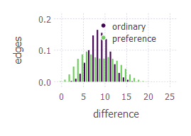
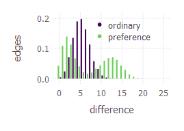
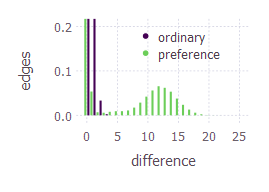
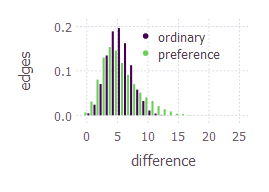
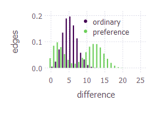

# Changes

- Two new variables: `nNeighbours` and `adjacentNeighbours`
- `nNeighbours` is how many neighbours to select as best neighbour
  - If `adjacentNeighbours` is `false`
    - It will take the neighbours with the best `eValues`
    - If multiple neighbours draw for the `eValue`, a random one is chosen
    - E.g. if the `eValues` are `[15, 14, 15, 19]`, `nNeighbours` is `2` and `adjacentNeighbours` is `false`, the best neighbours will be at indexes `[4, 1]` or `[4, 3]` (chosen randomly)
  - If `adjacentNeighbours` is `true`
    - It will combine all combinations of `nNeighbours` size of adjacent neighbours
    - E.g. if there are 4 `eValues`, `nNeighbours` is `2` and `adjacentNeighbours` is `true`, the combinations will look like: `[1+2, 2+3, 3+4, 4+1]`
- `tEpoch` was set to `25000` for the first row, then lowered to `5000` for the rest of the rows due to `25000` taking ~40 minutes origionally

# Outcomes

| Temperature | Possible Neighbours | `nNeighbours` | `adjacentNeighbours` | Graph | File |
| - | - | - | - | - | - |
| `0.45` | `4` | `2` | `false` |  | [Data](prefrence/4/0.45/2/false) |
| `0.45` | `4` | `2` | `true` |  | [Data](prefrence/4/0.45/2/true) |
| `0.3` | `4` | `2` | `true` |  | [Data](prefrence/4/0.3/2/true) |
| `0.15` | `4` | `2` | `true` |  | [Data](prefrence/4/0.15/2/true) |
| `0.3` | `4` | `3` | `true` |  | [Data](prefrence/4/0.3/3/true) |
| `0.3` | `8` | `2` | `true` |  | [Data](prefrence/8/0.3/2/true) |
